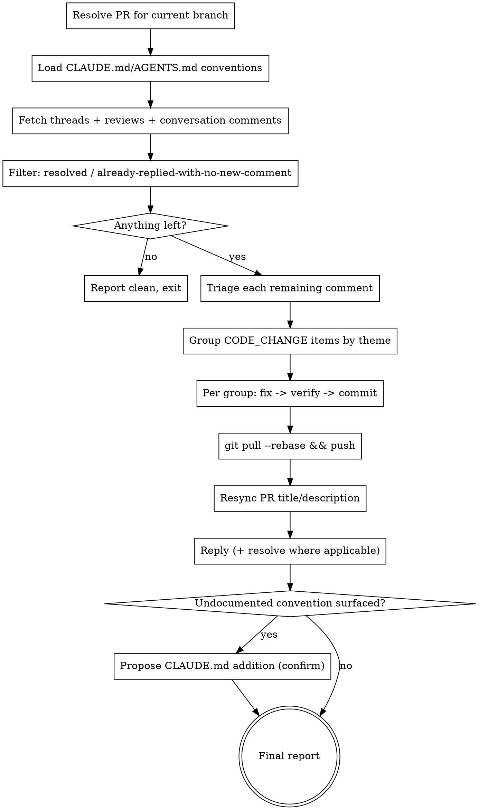

# Address PR Comments

Fetch every open comment on the current branch's pull request — inline review threads, review-summary bodies, and general conversation comments — fix what's actionable, run the project's own verification, push, resync the PR title/description, and reply to each thread (resolving where appropriate). GitHub only for now; see Provider Operations below for the extension point.

## Usage

```
/address-pr-comments
```

No arguments. Operates on the PR for the current git branch.

## Requirements

- `gh` CLI, authenticated (`gh auth status`)
- `git`
- Run from inside the target repo, on the branch with an open PR

## Provider Operations

This skill is written against GitHub. Provider dispatch is a single lookup keyed off the normalized remote host (strip `.git`, normalize SSH→HTTPS, lowercase — see `superset-pr-review`'s URL normalization for the pattern). Fill in a GitLab column here to extend to merge requests.

| Operation | GitHub |
|---|---|
| Find PR for current branch | `gh pr view --json number,title,body,url,headRefName,baseRefName` |
| Fetch inline review threads + resolved state | `gh api graphql` — `reviewThreads` query (Step 3) |
| Fetch review summaries | `gh api repos/{owner}/{repo}/pulls/{number}/reviews` |
| Fetch conversation comments | `gh api repos/{owner}/{repo}/issues/{number}/comments` |
| Reply to inline comment | `gh api repos/{owner}/{repo}/pulls/{number}/comments/{comment_id}/replies -f body='...'` |
| Reply to conversation comment | `gh api repos/{owner}/{repo}/issues/{number}/comments -f body='...'` |
| Resolve inline thread | `gh api graphql` — `resolveReviewThread` mutation (Step 9) |
| Update PR title/description | `gh pr edit <number> --title "..." --body "..."` |

## Process



### Step 1: Resolve the PR

```bash
gh pr view --json number,title,body,url,headRefName,baseRefName
```

No PR found for the current branch → stop and tell the user: `No open PR found for branch <branch>. Push the branch and open a PR first.`

Get the repo slug:

```bash
gh repo view --json nameWithOwner -q .nameWithOwner
```

### Step 2: Load conventions

Read root `CLAUDE.md` and `AGENTS.md` if present, plus any nested ones covering directories the comments touch. Every fix in Step 6 must honor these — a fix that contradicts a documented convention is a bug in the fix, not a valid reading of the comment.

### Step 3: Fetch comment sources

**Inline review threads** (GraphQL — this is the only source for resolved state):

```bash
gh api graphql -f query='
query($owner: String!, $repo: String!, $number: Int!) {
  repository(owner: $owner, name: $repo) {
    pullRequest(number: $number) {
      reviewThreads(first: 100) {
        nodes {
          id
          isResolved
          comments(first: 50) {
            nodes { id databaseId author { login } body path line }
          }
        }
      }
    }
  }
}' -F owner="$OWNER" -F repo="$REPO" -F number="$PR_NUMBER"
```

If this call fails (403 / insufficient scope), fall back to REST and treat every comment as unresolved (REST has no resolved-state field) — note the gap in the final report:

```bash
gh api repos/$OWNER/$REPO/pulls/$PR_NUMBER/comments
```

**Review summaries** — keep only reviews with a non-empty `body`:

```bash
gh api repos/$OWNER/$REPO/pulls/$PR_NUMBER/reviews
```

**Conversation comments:**

```bash
gh api repos/$OWNER/$REPO/issues/$PR_NUMBER/comments
```

### Step 4: Filter

Get the authenticated user:

```bash
gh api user -q .login
```

Drop:
- Any inline thread with `isResolved: true`
- Any item (thread, review, or conversation comment) whose most recent comment/reply author is the authenticated user, with nothing newer after it

If nothing remains, report "No unresolved PR feedback found." and stop — no commits, no push, no PR edit, no replies.

### Step 5: Triage

Classify each remaining item:

| Category | Meaning | Action |
|---|---|---|
| `CODE_CHANGE` | Clearly actionable | Implement it |
| `NON_APPLICABLE` | Understood, deliberate no — conflicts with a documented convention, out of scope, or already handled elsewhere | Reply with reasoning, no code change |
| `DISCUSSION` | Genuinely ambiguous, a question, or a judgment call only the user can make | Reply (answer honestly or ask for clarification) |

Never guess an answer to force something into `CODE_CHANGE` or `NON_APPLICABLE` just to close the loop — a wrong guess is worse than an honest question.

### Step 6: Group and fix

Group `CODE_CHANGE` items by shared root cause or theme — not by file, not one-to-one per comment. Example: three inline comments in three different files all about missing null checks → one group, one commit.

For each group:

1. Implement the fix, honoring the conventions loaded in Step 2.
2. Detect and run the project's own verification, checking in order:
   - Commands documented in the target repo's own `CLAUDE.md` (e.g. a "Session Completion" or "Quality gates" section)
   - `package.json` `scripts.test` / `scripts.lint` / `scripts.build`
   - `Makefile` targets named `test`, `lint`, `build`, `check`

   If nothing is detectable, skip verification for this group and flag it in the final report as unverified — don't block on it.
3. If verification fails, do not commit this group. Note the failure and continue to the next group.
4. Commit with a Conventional Commit message (`fix(scope): ...`, `refactor(scope): ...`) describing what changed, matching the target repo's own commit conventions if documented.

### Step 7: Push

```bash
git pull --rebase
git push
```

Automatic — no confirmation pause. If the rebase produces conflicts, stop and surface them; do not attempt to resolve conflicts automatically.

### Step 8: Resync PR title/description

If Step 6 produced at least one commit, regenerate the PR title and description from the final diff every run:

```bash
gh pr edit $PR_NUMBER --title "<title>" --body "<body>"
```

### Step 9: Reply and resolve

| Category | Reply | Resolve? |
|---|---|---|
| `CODE_CHANGE` | Summarize the fix and reference the commit | Yes |
| `NON_APPLICABLE` | Explain the reasoning | Yes |
| `DISCUSSION` | Answer or ask for clarification | No |

Reply to inline comments:

```bash
gh api repos/$OWNER/$REPO/pulls/$PR_NUMBER/comments/$COMMENT_ID/replies -f body="$REPLY_BODY"
```

Reply to conversation comments:

```bash
gh api repos/$OWNER/$REPO/issues/$PR_NUMBER/comments -f body="$REPLY_BODY"
```

Resolve an inline thread:

```bash
gh api graphql -f query='mutation($threadId: ID!) { resolveReviewThread(input: {threadId: $threadId}) { thread { id isResolved } } }' -F threadId="$THREAD_ID"
```

If this mutation fails (403 / insufficient scope), skip resolving — the REST reply above still posts, since it typically has a broader scope requirement — and flag it in the final report: `Could not resolve thread <id> — check gh auth scope (try: gh auth refresh -s repo) or org SSO authorization.`

### Step 10: Surface undocumented conventions

If a comment revealed a convention that isn't yet written down in the target repo's `CLAUDE.md`/`AGENTS.md`, propose an addition: show the exact diff and ask the user to confirm before writing. This is separate from Step 7's pre-authorized push — editing project docs is a durable decision that gets its own checkpoint even though pushing code doesn't.

### Step 11: Final report

Summarize for the user:
- Commits made (message + files)
- Threads/comments resolved vs. left open, and why
- Verification results per group (passed / failed / skipped-unverified)
- PR title/description changes
- Any proposed or applied CLAUDE.md changes
- Any scope-related gaps (REST fallback used, resolves skipped)

## Error Handling

| Condition | Behavior |
|---|---|
| No PR for current branch | Abort, no guessing a PR number |
| `gh` not installed / not authenticated | Abort with `gh auth login` instructions |
| No unresolved feedback found | Report clean, exit — no writes |
| No detectable verification tooling for a group | Skip verification, flag as unverified in final report |
| A group's verification fails | Skip that commit, continue with remaining groups |
| Rebase conflicts on push | Abort push, surface conflict for manual resolution |
| Ambiguous comment intent | Triage as `DISCUSSION`, ask rather than guess |
| GraphQL query/mutation fails on scope | Fall back to REST / skip resolve, flag gap in final report |

## Rules

- **NEVER** resolve a `DISCUSSION`-triaged thread — only `CODE_CHANGE` and `NON_APPLICABLE`
- **NEVER** guess past ambiguity to force a category
- **NEVER** commit a fix group whose verification failed
- **NEVER** write to a target repo's `CLAUDE.md`/`AGENTS.md` without explicit confirmation
- **ALWAYS** resync PR title/description after pushing if Step 6 produced any commit
- **ALWAYS** treat GraphQL scope failures as a fallback trigger, not an abort condition

## Examples

**Default run:**
```
/address-pr-comments
```
Resolves the PR for the current branch, addresses every unresolved comment, pushes, and reports what changed.

**Nothing to do:**
```
/address-pr-comments
```
On a branch whose PR has no unresolved comments → `No unresolved PR feedback found.`, no writes.
