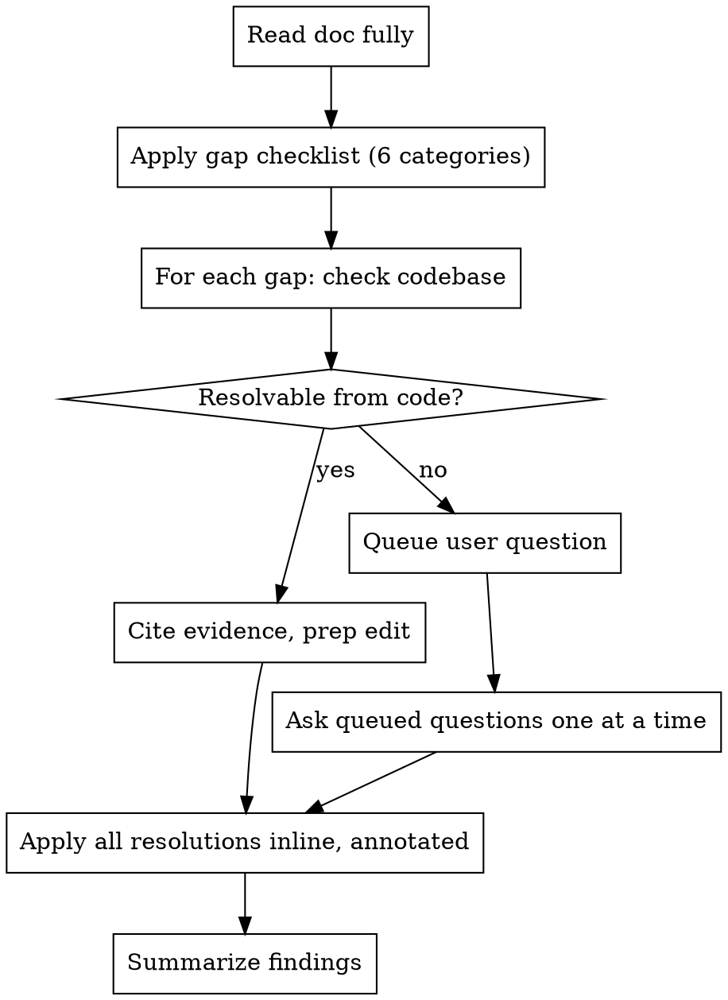

# Plan Critic

Cynically review a markdown plan or spec: assume by default that it is incomplete or
wrong somewhere. Run a fixed gap checklist against the whole document, resolve every gap
against the actual codebase before ever asking the user, and escalate only what the code
can't answer. Every resolution is written back into the document in place, annotated with
its source.

## Process



## Step 1: Read the Document Fully

Read the entire plan/spec before critiquing any part of it. Partial reads miss
contradictions between sections.

## Step 2: Apply the Gap Checklist

Run all six categories against the full document, every time — do not skip any because
the doc "looks complete":

1. **Unstated assumptions** — claims treated as given with no stated basis (e.g. "the API
   will return JSON", "users are already authenticated").
2. **Missing/vague success criteria** — goals that aren't measurable or verifiable (e.g.
   "improve performance", "make it robust").
3. **Unhandled edge cases** — error paths, empty/null/concurrent/scale cases not
   addressed.
4. **Unstated dependencies/prerequisites** — other systems, teams, data, or in-flight
   work the plan silently relies on.
5. **Scope ambiguity** — unclear boundaries: what's explicitly out of scope, where this
   hands off to something else.
6. **Internal contradictions** — sections that conflict with each other.

For each hit, record: the category, the exact text/section it applies to, and what's
missing or assumed.

## Step 3: Attempt Self-Resolution Against the Codebase

Before asking the user anything, check whether the gap is actually a fact about the
existing codebase:

- Grep/read the relevant files.
- If the code confirms or refutes the assumption (a field exists, a function behaves a
  certain way, a dependency is already satisfied), that's a **resolution** — capture the
  exact `file:line` as evidence.
- If the gap is a product/design decision — not something the code can answer (an
  unmeasurable goal, an ambiguous scope boundary, a choice between behaviors) — it is
  **not resolvable from code**. Do not guess. Queue it.

## Step 4: Escalate Unresolved Gaps to the User

Ask one question at a time. Prefer multiple-choice when the possible answers are
enumerable; open-ended otherwise. Do not batch multiple gaps into a single question — the
user can't triage a wall of questions at once.

## Step 5: Apply Resolutions Inline

Rewrite the ambiguous sentence or section directly, in place, with the resolved
specifics folded in. Every rewrite carries a short annotation naming its source, so the
audit trail survives in the doc itself:

- Codebase-resolved facts: `(confirmed: \`path:line\`)`
- User-resolved decisions: `*(user-specified; previously unstated)*` or
  `*(user-specified; previously ambiguous)*`

Example:

```markdown
The API returns a normalized JSON payload (confirmed: `api/handler.go:42`).

Success criteria: p95 latency < 200ms *(user-specified; previously unstated)*.
```

Edit the original file directly — never write a `-reviewed` copy. The file should
already be under version control; the resulting diff is the audit trail.

## Step 6: Summarize

Report to the user:
- Total gaps found, broken down by category
- How many were auto-resolved from the codebase (with evidence)
- How many required user input, and what was decided

Do not paste the full diff into chat — the user can run `git diff` themselves.

## Rules

- **Never skip a checklist category** — run all six every time, even if the doc looks
  tight.
- **Never guess a product/design decision** — anything the code can't settle goes to the
  user.
- **Never silently rewrite** — every inline change carries its evidence/decision
  annotation.
- **Never touch files outside the target doc** — read the codebase freely for evidence,
  but only ever edit the one plan/spec file.
- **One question at a time** when escalating to the user.

## Common Mistakes

| Mistake | Fix |
|---|---|
| Skipping a category because the doc "looks solid" | Run all six every time — that's the point of a cynical review. |
| Asking the user something the code already answers | Grep/read first. Only escalate what code can't settle. |
| Batching five questions into one message | One question at a time — let the user triage. |
| Rewriting a sentence with no annotation | Every inline edit cites its source (file:line or user-specified). |
| Writing a `-reviewed` copy instead of editing in place | Edit the original file directly; the diff is the record. |
