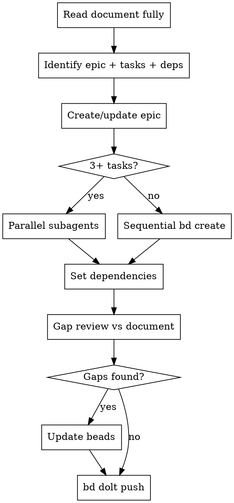

# Beads from Plan/Spec

Convert a markdown implementation plan, spec, or design document into a structured set of Beads issues: one epic for the initiative, one task per discrete workstream, and dependency links between them.

**Prefer plans over specs.** A plan already has discrete steps and sequencing — use it directly. Only fall back to a spec if no plan exists.

## Process



## Step 1: Parse the Document

Read the entire document before creating anything. Map sections to Beads fields:

| Document element | Beads field |
|---|---|
| Title / Overview | Epic title + description |
| Steps / Tasks / Workstreams | One task per independently implementable unit |
| Acceptance criteria | Included in each task `--description` |
| Sequencing / "depends on" / numbered steps | `bd dep add` relationships |
| File path | Epic `--notes="Plan: <path>"` or `--notes="Spec: <path>"` |
| Design decisions | `--notes` on relevant task |

**Task granularity:** If two things must always be done together → merge into one task. If they can be worked independently or in parallel → separate tasks.

## Step 2: Create or Update the Epic

**New epic:**
```bash
bd create \
  --title="<initiative title>" \
  --type=feature \
  --priority=<P0-P4> \
  --description="<overview paragraph from document>" \
  --notes="Plan: <path/to/file.md>"
```

**Existing bead as epic** (e.g. a pre-existing feature bead):
```bash
bd update <existing-id> --notes="Plan: <path/to/file.md>"
```

## Step 3: Create Tasks

**3+ tasks → use superpowers:dispatching-parallel-agents**  
**1–2 tasks → run `bd create` calls in the same message**

Each task `--description` MUST include:
- Specific, implementable steps ("what needs to be done")
- Verifiable acceptance criteria
- Any implementation details from the spec that affect how the task is built

**IMPORTANT: `bd` renders descriptions as markdown.** Numbered list markers (`1. `) get their period+space stripped, turning `1. Write` into `1Write`. Plain text without list syntax collapses into one paragraph with no line breaks.

The correct pattern: use unordered list syntax (`- `) combined with `Step N:` / `ACN:` prefixes. The `-` provides line breaks; the prefix provides readable labels after the `-` is stripped:

```
Steps:
- Step 1: Write the failing test
- Step 2: Implement the feature
- Step 3: Verify the test passes

Acceptance criteria:
- AC1: <measurable outcome>
- AC2: <measurable outcome>
```

```bash
bd create \
  --title="<task title>" \
  --type=task \
  --priority=<match epic> \
  --parent=<epic-id> \
  --description="<steps + acceptance criteria>"
```

## Step 4: Set Dependencies

```bash
# Y depends on X (X must finish before Y can start)
bd dep add <Y-id> <X-id>

# Epic blocked until key task is done
bd dep add <epic-id> <final-task-id>
```

Derive order from spec sequencing language: "before", "after", "once X is done", "requires X".  
Direction: `bd dep add <the-thing-that-waits> <the-thing-it-waits-for>`.

## Step 5: Gap Review

Re-read the spec section by section. For each bead, verify:

- [ ] All acceptance criteria from the spec are captured
- [ ] All implementation details that constrain how the task is built are present
- [ ] Dependency direction is correct (run `bd show <id>` to confirm)
- [ ] File path is in the epic notes
- [ ] No section of the spec is unrepresented

**The gap review always finds something.** Do not skip it.

Fix gaps inline:
```bash
bd update <id> --description="<updated description>"
```

## Step 6: Push

```bash
bd dolt push
```

## Rules

- **NEVER use `bd edit`** — opens $EDITOR, blocks agents; use `bd update --description` instead
- **NEVER use TodoWrite or TaskCreate** for tracking this work
- **NEVER skip the gap review** — the point is to catch what was missed
- **Always reference the spec path** in the epic `--notes`
- **Dependency direction matters** — wrong direction silently creates incorrect blocking

## Common Mistakes

| Mistake | Fix |
|---|---|
| Skipping gap review because "it looks complete" | The gap review always finds something. Run it. |
| Wrong dependency direction | `bd dep add <waits> <provides>` — the waiter comes first |
| Vague acceptance criteria ("works correctly") | Spec what is measurable: inputs, outputs, observable behavior |
| One giant task for everything | Split on independent implementability, not on topic |
| Forgetting to push | `bd dolt push` or changes are local-only |
